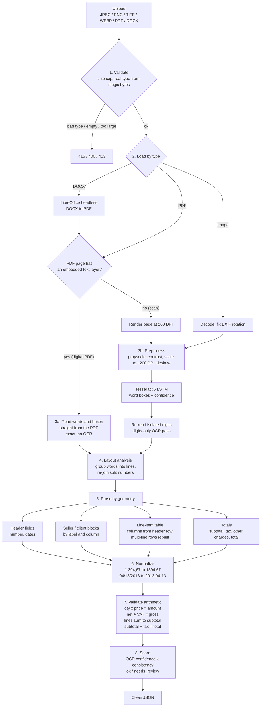
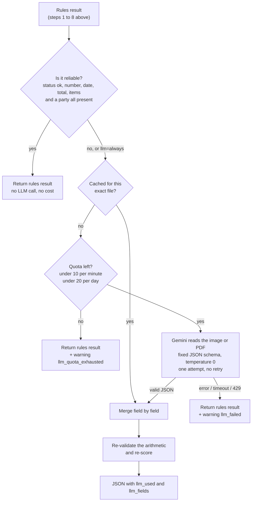
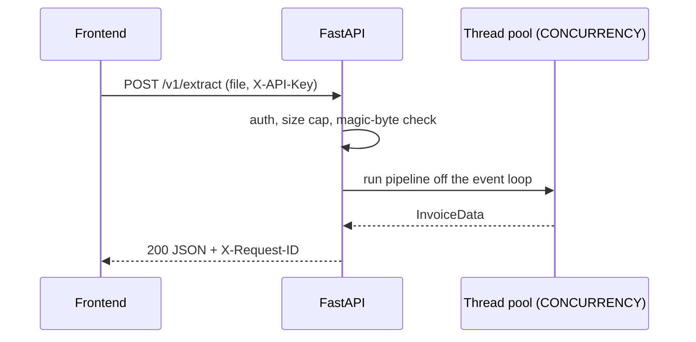

# Invoice Extraction API

Upload an invoice (**JPEG, PNG, TIFF, WEBP, PDF or DOCX**) and get back clean, structured JSON.

A stateless FastAPI service. There is no database and no queue: each request is processed in memory and returned in the response, and nothing is stored. An optional Gemini fallback fills in what the rules cannot read, within a strict request quota.

- [Pipeline](#pipeline)
- [LLM fallback](#llm-fallback-gemini)
- [Quick start](#quick-start)
- [API reference](#api-reference)
- [Testing with Bruno](#testing-with-bruno)
- [Accuracy](#accuracy)
- [Production notes](#production-notes)
- [Development](#development)
- [Project layout](#project-layout)
- [Known limits](#known-limits)

---

## Pipeline



### What each step does

| # | Step | What happens | Why it matters |
|---|---|---|---|
| 1 | **Validate** | Reads the upload with a hard size cap and identifies the file type from its **magic bytes**, not the filename or `Content-Type`. DOCX is told apart from other ZIP formats and checked for decompression bombs. | Rejects junk early with a clear 4xx, before any expensive work. |
| 2 | **Load** | Images are decoded and EXIF-rotated. A DOCX is converted to PDF with headless LibreOffice, using a private profile per call so it is safe under concurrency. PDFs are opened with PyMuPDF. | DOCX and PDF then share one path. |
| 3a | **Text layer** (digital PDF/DOCX) | If a PDF page has an embedded text layer, the words and their exact bounding boxes are read directly. | Exact, with no OCR errors, and far faster. |
| 3b | **OCR** (scans, photos, image-only PDFs) | The page is made grayscale, contrast-normalised, scaled to about 200 DPI and **deskewed** using the dark text pixels. **Tesseract 5** (LSTM engine) then returns every word with a bounding box and confidence. Single digits that block-level OCR commonly misreads (for example `2` read as `9`, or `5` read as `a`) are re-read with a digits-only pass. | Tesseract is accurate on printed text but weak on isolated glyphs, so the second pass fixes those. |
| 4 | **Layout analysis** | Words are clustered into visual lines by vertical position. Numbers that OCR split at the thousands separator (`1` + `394,67`) are re-joined. | Spatial structure is what makes table extraction possible. |
| 5 | **Parse by geometry** | The parser reads word positions rather than flat text. **Header fields** come from `Invoice no / Invoice # / Date / Due date` labels. **Seller and client** blocks are cut by label and column. The **table** is located from its header row (`Description`, `Qty`, `Price`, `Net worth`, `VAT`, `Gross`…), and columns are derived from header positions. Rows are rebuilt from vertical position, so descriptions that wrap across lines stay with the right row. **Totals** are found by label (`Subtotal`, `Sales Tax 8%`, `Shipping`, `Total Due`). | Handles different layouts (two-column Seller/Client invoices and free-form invoices) with one generic parser. |
| 6 | **Normalize** | Locale-aware numbers (`1 394,67`, `1.234,56`, `$12.00`, `(5.00)`) become numbers. Dates (`04/13/2013`, `Mar 13, 2022`) become ISO `yyyy-mm-dd`. Ambiguous dates follow `DATE_ORDER`. | The frontend gets typed values, not strings to clean. |
| 7 | **Validate** | Checks arithmetic: quantity × price = line amount, net + VAT = gross, line amounts sum to the subtotal, and subtotal + tax + charges − discount = total. Also checks that the invoice number, date and total are present. | OCR can silently misread a digit. A wrong digit almost always breaks the arithmetic, so this catches it. |
| 8 | **Score** | `confidence` = mean OCR confidence × a penalty for every failed check or missing field. `meta.status` is `needs_review` if any check failed or confidence is below `REVIEW_THRESHOLD`. | The UI can flag suspect results instead of showing wrong numbers as fact. |

### LLM fallback (Gemini)

The rules run first and handle most documents for free and offline. **Gemini 3.5 Flash Lite** is a second stage for the documents the rules cannot read reliably: unfamiliar labels or layouts, a seller with no label, a misread digit, a photo with a stamp.



**When it is called.** `LLM_MODE=auto` (default) calls it only when the rules result is `needs_review`, a key field is missing (invoice number, date, total or items), or no party was found. `always` calls it for every document, and `off` never does. Override per request with `?llm=auto|always|off`.

**What is sent.** The document itself: the original image (re-encoded as JPEG, at most 2048 px), the PDF, or the PDF converted from a DOCX. Gemini reads it directly, so it also fixes OCR misreads. The request uses a JSON schema that matches our output, so the reply is always valid JSON in our shape.

**How the answer is merged.** The LLM is never trusted blindly:

| Situation | Result |
|---|---|
| Rules left a field empty | Take the LLM value |
| Both agree | Keep it |
| They differ, and the rules result was `ok` | Keep the rules value |
| They differ, and the rules result was `needs_review` | Take the LLM value |
| Line items and totals | Use whichever combination passes the arithmetic checks. Ties go to the rules when they were `ok`, to the LLM otherwise. |
| A seller guessed from the letterhead | Not trusted: the LLM wins a disagreement |

The merged result is validated again. The response says what happened: `meta.llm_used`, `meta.llm_fields` (for example `["seller.name", "items"]`) and the model name in `meta.engine`, so the UI can mark AI-filled fields. When the LLM contributed, the confidence is scored from the arithmetic checks, because the model read the image itself.

**Quota guard (never exceeded).**
- At most `LLM_RPM` (10) requests in any rolling 60 seconds and `LLM_RPD` (20) per day. The day resets at midnight Pacific time, like Google's quota.
- A request is reserved **before** it is sent, and every attempt counts, successful or not. There are **no retries**, because a retry would spend quota.
- The counter lives in a file with a lock shared by all worker processes, and on a Docker volume (`llm_state`) so it survives restarts and rebuilds. Several replicas on different machines do not share it, so give each replica its share of the quota through `LLM_RPM` and `LLM_RPD`.
- The same file is never sent twice: answers are cached by the file's hash, so re-testing the same invoice costs nothing.
- Check what is left at any time: `GET /readyz` returns `llm.remaining_today` and `llm.remaining_this_minute`.
- With 20 requests per day, `auto` mode is the right default. `always` is for testing.

**Failure behaviour.** The LLM never makes a request fail. A missing key, an exhausted quota, a timeout, a 429 or an invalid reply all return the rules result with a warning (`llm_not_configured`, `llm_quota_exhausted` or `llm_failed`).

**Privacy and cost.** With a key set, documents that trigger the fallback are sent to Google. With no key, or with `LLM_MODE=off`, nothing leaves your machine. Check Google's current pricing and terms for the model before using real customer invoices.

### Request handling



The pipeline is CPU-bound, so it runs in worker threads off the event loop, bounded by `CONCURRENCY` so a burst of uploads cannot exhaust the machine.

---

## Quick start

### Docker (recommended, includes Tesseract 5 and LibreOffice)

```bash
cp .env.example .env        # set API_KEYS and CORS_ORIGINS
docker compose up --build
curl localhost:8000/readyz
```

Interactive docs are at <http://localhost:8000/docs> whenever `ENV` is not `production`.

### Without Docker

Requires Python 3.12, `tesseract-ocr` 5.x and, for DOCX, `libreoffice-writer`.

```bash
python -m venv .venv && . .venv/bin/activate
pip install -r requirements-dev.txt
cp .env.example .env
uvicorn app.main:app --reload
```

### Configuration (`.env`)

| Variable | Default | Meaning |
|---|---|---|
| `API_KEYS` | *(empty = auth off)* | Comma-separated keys accepted in the `X-API-Key` header |
| `CORS_ORIGINS` | *(none)* | Comma-separated frontend origins, e.g. `http://localhost:5173` |
| `ENV` | `production` | Anything other than `production` also serves `/docs` |
| `LOG_LEVEL` | `INFO` | Log verbosity |
| `MAX_UPLOAD_MB` | `15` | Per-file size cap (413 above it) |
| `MAX_BATCH_FILES` | `10` | Files per `/v1/extract/batch` request |
| `MAX_PDF_PAGES` | `10` | Pages processed per document |
| `CONCURRENCY` | `2` | Documents processed in parallel per worker process |
| `DATE_ORDER` | `MDY` | How to read ambiguous dates such as `04/05/2020` (`MDY` or `DMY`) |
| `REVIEW_THRESHOLD` | `0.80` | Confidence below this sets `needs_review` |
| `GEMINI_API_KEY` | *(empty = no LLM)* | Enables the Gemini fallback |
| `LLM_MODE` | `auto` | `auto`, `always` or `off` |
| `LLM_MODEL` | `gemini-3.5-flash-lite` | Gemini model id. Ids get retired: a `404 NOT_FOUND` in the logs means pick a current one |
| `LLM_TEMPERATURE` | `0` | Sampling temperature for extraction |
| `LLM_TIMEOUT_S` | `30` | Per-request timeout |
| `LLM_RPM` / `LLM_RPD` | `10` / `20` | Hard request quota per rolling minute / per day |
| `LLM_STATE_DIR` | `/tmp/invoice-llm` | Quota counter and result cache (a volume in Docker) |

---

## API reference

All `/v1/*` endpoints need the header `X-API-Key: <key>` (when `API_KEYS` is set).

### `POST /v1/extract`

`multipart/form-data` with one field, **`file`**. Returns the extraction directly. Typical time is 0.5 to 2 s per image page, and faster for digital PDFs.

```js
const body = new FormData();
body.append("file", fileInput.files[0]);

const res = await fetch(`${API}/v1/extract`, { method: "POST", headers: { "X-API-Key": KEY }, body });
if (!res.ok) throw new Error((await res.json()).detail);
const invoice = await res.json();
```

Do not set `Content-Type` yourself. The browser adds the multipart boundary.

Optional query parameter `?llm=auto|always|off` overrides `LLM_MODE` for this request.

### `POST /v1/extract/batch`

Same, with repeated **`files`** fields (up to `MAX_BATCH_FILES`). One bad file never fails the batch:

```json
{ "results": [
  { "filename": "a.jpg",   "ok": true,  "data": { "...": "same shape as /v1/extract" }, "error": null },
  { "filename": "bad.txt", "ok": false, "data": null, "error": "Unsupported file type (expected JPEG, PNG, TIFF, WEBP, PDF or DOCX)" }
] }
```

### `GET /healthz` and `GET /readyz`

Liveness and readiness (no auth). `/readyz` returns 503 if Tesseract is unavailable, and reports whether DOCX support is installed and the LLM state: mode, model and the remaining quota.

### Response shape

```jsonc
{
  "invoice": {
    "invoice_number": "51109338",
    "date": "2013-04-13",          // always ISO yyyy-mm-dd or null
    "due_date": null,
    "currency": "USD"              // from the symbol seen ($ € £), else null
  },
  "seller": { "name": "Andrews, Kirby and Valdez", "address": "58861 Gonzalez Prairie\nLake Daniellefurt, IN 57228",
              "tax_id": "945-82-2137", "iban": "GB75MCRL06841367619257" },
  "client": { "name": "Becker Ltd", "address": "…", "tax_id": "942-80-0517", "iban": null, "email": null },
  "items": [
    { "line": 1, "description": "CLEARANCE! Fast Dell Desktop Computer PC DUAL CORE WINDOWS 10 4/8/16GB RAM",
      "quantity": 3, "unit": "each", "unit_price": 209.0, "vat_percent": 10,
      "net_amount": 627.0,         // line amount before tax
      "gross_amount": 689.7 }      // including tax, only when the invoice shows it
  ],
  "summary": {
    "subtotal": 5640.17,           // net total before tax
    "tax": 564.02, "tax_rate": null,
    "discount": null,
    "other_charges": [ { "label": "Shipping and Handling", "amount": 10.0 } ],
    "total": 6204.19,              // grand total of the invoice
    "amount_paid": null,           // only when printed
    "amount_due": null             // outstanding balance, 0.0 when already paid
  },
  "payment": { "beneficiary": null, "bank": null, "iban": null, "bic": null, "account_number": null, "reference": null },
  "meta": {
    "status": "ok",                // "ok" | "needs_review"
    "confidence": 0.914,           // 0..1
    "warnings": [],
    "pages": 1,
    "engine": "tesseract-5.3.0",   // and/or "pdf-text-layer"; "+gemini-3.5-flash-lite" when the LLM was used
    "llm_used": false,             // true when the LLM contributed
    "llm_fields": [],              // e.g. ["seller.name", "items"]: show these as AI-filled
    "processing_ms": 704
  }
}
```

**Rules the frontend can rely on**

- Missing data is `null`. Amounts and quantities are JSON numbers, and dates are ISO strings. Nothing is guessed.
- `items[].description` has visual line breaks joined with spaces. Party `address` keeps `\n` between lines.
- Different invoices show different columns. Only the amount columns present on the document are filled. For example, a free-form invoice has `net_amount` but no `gross_amount` or `vat_percent`.
- **Show a "please review" state when `meta.status === "needs_review"`.** It is set when the arithmetic does not add up, a key field is missing, or confidence is low. `meta.warnings` explains why, for example `item_4:qty_x_price_ne_net`, `items_sum_ne_subtotal`, `subtotal_plus_tax_ne_total`, `missing:invoice_number`, `missing:parties`. Other codes: `seller_from_letterhead` (seller inferred from the top block, not labelled), `item_5:unit_price_derived`, `llm_filled`, `llm_not_configured`, `llm_quota_exhausted`, `llm_failed`.
- `seller` and `client` are filled from labels (`Seller:`, `From (Seller)`, `Bill To:`, `To (Buyer)`, `Customer:`…). With no seller label, the issuer is taken from the letterhead (first block above the title) and `warnings` contains `seller_from_letterhead`. If nothing is found, they are all-`null` with `missing:parties`.

### Errors

The body is always `{"detail": "..."}`. Every response carries an `X-Request-ID` header, so send it with bug reports.

| Status | Meaning |
|---|---|
| 400 | Empty file |
| 401 | Missing or invalid `X-API-Key` |
| 413 | File over `MAX_UPLOAD_MB` (or too many batch files) |
| 415 | Not JPEG/PNG/TIFF/WEBP/PDF/DOCX. The type is checked from the file's bytes, not its extension. |
| 422 | Supported type but unreadable: corrupt, encrypted PDF, or no text found |
| 504 | OCR or DOCX conversion timed out |

---

## Testing with Bruno

Open the [`bruno/`](bruno) **folder** (not `bruno.json`) as a collection in Bruno and choose the **local** environment (`baseUrl`, `apiKey`). Three requests:

| Request | Use |
|---|---|
| `01 Readiness (quota left)` | Is the API up, and how many Gemini requests are left |
| `02 Extract one invoice` | Pick any JPG, PNG, PDF or DOCX in the Body tab. Tick the `llm` query param to try the Gemini fallback. Untick the `X-API-Key` header to see the 401 error. |
| `03 Extract batch (up to 10)` | Several files in one call, with one result per file |

---

## Accuracy

The [dataset](https://huggingface.co/datasets/Voxel51/high-quality-invoice-images-for-ocr) has ground-truth JSON for about 1,400 invoices. `scripts/evaluate.py` downloads N of them and scores the pipeline field by field:

```bash
PYTHONPATH=. python scripts/evaluate.py --n 100 --seed 1
```

Result on 100 random annotated invoices (Tesseract path, about 0.7 s each):

| Field | Accuracy |
|---|---|
| invoice number, date, seller name, client name, seller address, tax total, item count | 100% |
| client address | 98% |
| grand total | 98% |
| item quantity (389 lines) | 100% |
| item description (similarity ≥ 0.9) | 100% |
| item amount | 98% |

7% of invoices were flagged `needs_review`, and these were genuinely wrong extractions caught by the arithmetic checks. One invoice scored as an error was a labelling inconsistency in the dataset (its ground-truth `total` is the net amount, while other invoices use gross). The extraction matched the document.

**Caveat:** only one layout (the "Seller / Client" template) is annotated, so these numbers describe that layout. The dataset's second, free-form layout has no ground truth. It is covered by tests and handled by the generic parser, but it is not scored.

---

## Production notes

**Security**
- API-key auth on every `/v1` route, compared in constant time. Set `API_KEYS` in production, since leaving it empty disables auth.
- File type is verified from content, with size caps, a page cap and a decompression-bomb guard. Uploads are processed in memory and never written to disk. The only exception is DOCX, which is converted in a temporary directory that is deleted afterwards.
- The container runs as a non-root user. `/docs` and `/openapi.json` are disabled when `ENV=production`.
- CORS is limited to `CORS_ORIGINS`, with only `GET`/`POST` and the `X-API-Key` header.
- Uploaded invoices are never logged, only request metadata.

**Observability**

Logs go to stdout, one line per event. `LOG_FORMAT=json` (default, for log collectors) or `LOG_FORMAT=text` (readable, for local work). `LOG_LEVEL` sets the verbosity. Every line carries the `request_id` of the request that caused it, including lines written from the worker thread, and the same id is returned in the `X-Request-ID` header. A client-sent id is used only if it is 1 to 64 characters of `A-Z a-z 0-9 . _ -`; otherwise a new one is generated.

| Event (logger) | When | Useful fields |
|---|---|---|
| `started` (api) | Process start | env, auth on/off, concurrency, LLM mode and quota |
| `request` (api) | Every request except health checks | method, path, status, ms |
| `rejected` (api) | 400, 413, 415, 422 | status, reason |
| `extracted` (pipeline) | One per document | kind, size_kb, pages, engine, status, rules_status, confidence, items, warnings, `llm` outcome, `stages_ms` (load, ocr, parse, llm), ms |
| `llm call` (llm) | Each Gemini request | model, ms, prompt_tokens, output_tokens, remaining_today, remaining_this_minute |
| `llm cache hit` (llm) | Same file seen before | quota_charged=false |
| `llm quota exhausted` (llm, WARNING) | Request not sent | remaining_this_minute, remaining_today |
| `gemini call failed` (llm, WARNING) | Timeout, 429, bad reply | error type, ms |
| `timed out`, `unhandled` | 504, unexpected errors | reason, stack trace |

The `llm` outcome in `extracted` is one of `not_needed`, `off`, `not_configured`, `quota_exhausted`, `failed`, `used` or `no_change`.

Invoice content is never logged: no names, numbers, amounts or text. Only counts, codes, timings and file sizes. A test enforces this.

Useful queries: `status=needs_review` for the review rate, `llm=quota_exhausted` for quota pressure, and `stages_ms.ocr` for slow documents. Each result also carries `processing_ms`, `confidence` and `warnings`. `GET /healthz` is for liveness and `GET /readyz` for readiness. The Docker image has a `HEALTHCHECK`.

**Scaling**
- The service is stateless, so scale horizontally behind a load balancer.
- Throughput per container is about `workers × CONCURRENCY` documents at once. Tesseract is pinned to one thread (`OMP_THREAD_LIMIT=1`), which scales better with several processes than with one multi-threaded one.
- For very large volumes or very long documents, put a queue in front. The pipeline function `app.pipeline.extract(bytes)` has no web dependencies and can be called from any worker.

**Not included (put these at your gateway or proxy)**
- Rate limiting, TLS termination and request-body limits at the proxy.
- Persistence. Callers that need history should store the JSON they receive.

---

## Development

```bash
pytest                          # unit, pipeline and API tests (needs tesseract; DOCX tests need libreoffice)
ruff check . && ruff format .   # lint and format
# or in Docker:
docker build --build-arg INSTALL_DEV=1 -t invoice-api:dev . && docker run --rm invoice-api:dev pytest -q
```

The test suite covers number and date normalization, both invoice layouts, scanned PDF (OCR path), digital PDF and DOCX (text-layer path), bad and unsupported files, auth, size and batch limits.

## Project layout

```
app/
  main.py            app factory, CORS, request-id and JSON access logs
  auth.py            X-API-Key dependency (constant-time compare)
  config.py          environment settings
  schemas.py         response models (the contract above)
  api/               routes (/v1/extract, /v1/extract/batch, health) and upload validation
  pipeline/
    preprocess.py    sniff file type, decode image/PDF, PDF text layer, deskew
    convert.py       DOCX to PDF via LibreOffice
    ocr.py           Tesseract 5 word boxes and numeric re-read
    layout.py        group words into lines, re-join split numbers
    parser.py        table/columns/rows, parties, header fields, totals
    normalize.py     numbers (1 394,67 to 1394.67) and dates (to ISO)
    validate.py      arithmetic checks
scripts/evaluate.py  accuracy against the dataset ground truth
bruno/               API collection for manual testing
tests/               unit, pipeline and API tests with fixture invoices
```

## Known limits

- English only (`TESSERACT_LANG` and a language pack would extend this).
- Printed documents. Handwriting and heavily distorted photos are not a target. They will usually come back `needs_review`.
- Layouts with unusual table headers (anything not recognisable as description, quantity, price, amount, VAT or gross) are returned with `table_header_unrecognised` and no items.
- At most `MAX_PDF_PAGES` pages per document. Multi-page documents merge their line items, and totals come from the last page that has them.
- Without a seller label the issuer is a best guess from the letterhead (flagged `seller_from_letterhead`).
- The LLM stage is limited by its quota (20 requests per day by default). Beyond that, the rules result is returned.
- Photos are flattened automatically, but OCR can still misread small or faint print (for example a light-grey address line). The arithmetic checks flag number errors, and the LLM fallback can correct text.
- The Gemini stage is covered by tests against a fake Gemini server (request shape, parsing, quota, cache, no retries). It has not been run against the live API in this repository's test suite, so try it once with your key (`llm=always`) and check `meta.llm_fields`.
